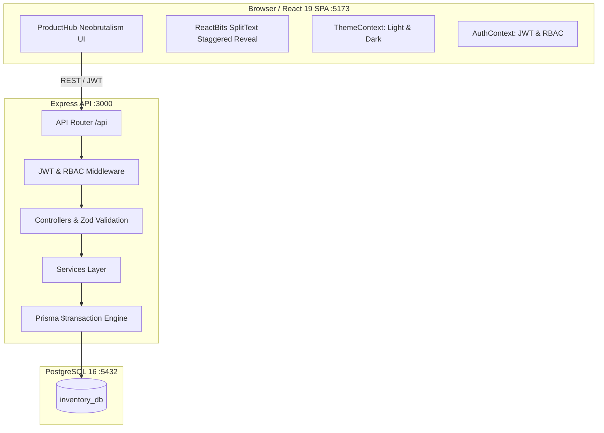

# ProductHub — Next-Gen Inventory & Order Management System

A production-grade enterprise inventory and order management system built with **React 19**, **Node.js + Express**, **PostgreSQL 16**, **Prisma ORM**, **JWT Authentication with RBAC**, styled with a high-voltage **Neobrutalism Design System** (featuring the **ReactBits 3D `DepthText`** component on the login screen, tactile micro-interactions, and live light/dark mode), and containerized with **Docker Compose**.

Designed specifically to demonstrate relational integrity, multi-item atomic stock transactions, state machine transitions, inventory reversal audits, and comprehensive unit testing.

---

## Highlights & Design System

- **ReactBits `SplitText` Animation:** Granular, staggered character reveal animation on the login screen with customizable easing and timing.
- **Neobrutalism Aesthetic:** Bold, unapologetic design featuring `border-3 border-black`, hard unblurred drop shadows (`shadow-[4px_4px_0px_#000]`, `shadow-[6px_6px_0px_#000]`), and tactile mechanical push-button micro-interactions (`active:translate-x-[2px] active:translate-y-[2px] active:shadow-none`).
- **High-Voltage Palette:** Electric Canary Yellow (`#FFE600`), Neo Cyan (`#00F0FF`), Neo Lime (`#00FF66`), Neo Coral (`#FF4365`), warm cream canvas (`#FFFDF5`), and obsidian dark mode.
- **Light / Dark Mode Switcher:** Seamless live theme toggle in the sidebar and login view, persisted to `localStorage`.
- **UI Primitives Library:** Reusable, type-safe components (`Button`, `Card`, `Badge`, `Spinner`, `EmptyState`, `ThemeToggle`, `SplitText`, `DepthText`).
- **45 Automated Tests:** 11 backend integration tests + 34 frontend component & hook unit tests with Vitest, Testing Library, and happy-dom.

---

## Architecture & Tech Stack

- **Frontend:** React 19 (Vite 8), React Router 7, Tailwind CSS 4 with Neobrutalism `@theme`, Axios, Lucide React, `@fontsource/inter`
- **Frontend Testing:** Vitest, `@testing-library/react`, `@testing-library/jest-dom`, happy-dom
- **Backend:** Node.js, Express, TypeScript (layered: `routes → controllers → services → data access`)
- **Backend Testing:** Vitest with database integration tests
- **Database & ORM:** PostgreSQL 16, Prisma ORM with migrations and seed data
- **Authentication:** JWT with Role-Based Access Control (`admin` and `staff`)
- **DevOps:** Docker Compose with automated migration deployment and seeding on boot



---

## Quickstart (Single Command)

### 1. Launch Stack
```bash
docker compose up --build
```

A single command will:
1. Spin up PostgreSQL 16 with a persistent Docker volume (`pgdata`).
2. Run database migrations (`npx prisma migrate deploy`).
3. Seed sample products (including low-stock items), customers, and admin/staff users (`npx prisma db seed`).
4. Start the Express API server on `http://localhost:3000`.
5. Start the React frontend on `http://localhost:5173`.

### 2. Demo Credentials

| Role | Email | Password | Permissions |
|------|-------|----------|-------------|
| **Admin** | `admin@inventory.com` | `AdminPassword123!` | Full privileges (manage catalog, users, restock, orders) |
| **Staff** | `staff@inventory.com` | `StaffPassword123!` | Operational privileges (view catalog, create customers & orders) |

*The login page includes 1-click autofill buttons for both demo accounts.*

---

## Automated Test Suite (41 Tests Total)

### Run Frontend Tests (30 tests)
```bash
cd frontend
npm test
```
**Test suites covered:**
- `DepthText.test.tsx` (4 tests): ReactBits 3D text front layer, extrusion layers, parallax offset on pointer move, custom styling.
- `Button.test.tsx` (5 tests): Neobrutalist variant styling, disabled state, loading spinner, click handling.
- `StatusBadge.test.tsx` (4 tests): Draft, Confirmed, Shipped, Cancelled color coding and dot indicators.
- `LowStockBadge.test.tsx` (3 tests): Healthy threshold check, low stock pill, critical out-of-stock badge.
- `ThemeToggle.test.tsx` (2 tests): Sun/Moon icon swap, toggle execution, label display.
- `ThemeContext.test.tsx` (3 tests): Dark mode default, localStorage persistence, `<html>` class manipulation.
- `AuthContext.test.tsx` (3 tests): Token storage, role state, unauthenticated handling, logout cleanup.
- `LoginPage.test.tsx` (4 tests): ProductHub DepthText rendering, input controls, demo autofill pills, error banners, submission.
- `DashboardPage.test.tsx` (2 tests): Loading spinner, telemetry metric cards rendering.

### Run Backend Tests (11 tests)
```bash
cd backend
npm test
```
**Test suites covered:**
- Atomic order placement with multi-item stock deduction and audit logging.
- Total transaction rollback when line item stock is insufficient.
- Order cancellation stock restoration and audit logging.
- Guard against cancelling shipped orders.
- Manual restock stock increment and logging.
- Role-based route protection (`admin` vs `staff`).
- Customer and Product REST APIs.

---

## Centerpiece: Transactional Stock Logic

### 1. Order Placement (`order.service.ts -> createOrder`)
1. **Deterministic Locking:** Product IDs are sorted (`sort((a, b) => a - b)`) before acquiring locks to guarantee deadlock-free concurrent execution.
2. **Pessimistic Row Locking:** In PostgreSQL, rows are locked via `SELECT ... FOR UPDATE` inside `prisma.$transaction`.
3. **Pre-flight Stock Check:** Validates that every line item has sufficient stock. If any product is short, an `AppError` triggers an immediate **`ROLLBACK`**, guaranteeing zero partial commits.
4. **Historical Price Freezing:** Captures `unit_price_at_order` so future product catalog price adjustments do not retroactively alter past receipts.

### 2. Cancellation & Stock Reversal (`order.service.ts -> updateOrderStatus`)
- When an order transitions to `cancelled`, a transaction atomically restores `quantityInStock` for each line item and writes positive audit records to `stock_movements` (`reason = 'adjustment'`).
- Enforces strict state machine rules: shipped orders cannot be cancelled.